# iMX6 Rex — 12-Layer PCB Design


> A custom 12-layer PCB design for the **Wandboard iMX6 Rex** System-on-Module (SoM), built upon the open-source schematic and fully routed by hand.

---

## 📌 Overview

This project is a complete PCB layout for the **i.MX6 Rex** SoM — a compact, high-performance embedded computing module based on the **NXP i.MX6** application processor. The schematic was sourced from the open-source Wandboard/iMX6 Rex reference design, and the **PCB layout was designed entirely from scratch** by me using professional EDA tooling.

The board features a dense 12-layer stackup to accommodate DDR memory routing, high-speed differential pairs, power planes, and controlled-impedance traces — all within a compact SoM form factor.

---

## 🖼️ PCB Images

### 3D Render — Front


### 3D Render — Back


### Layer Stackup Views

| Layer | Preview |
|-------|---------|
| L1 — Top Copper | 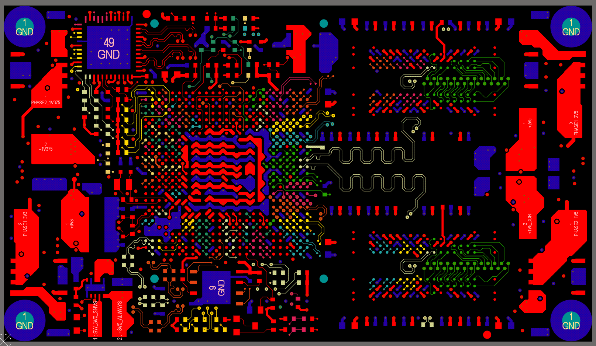 |
| L2 | 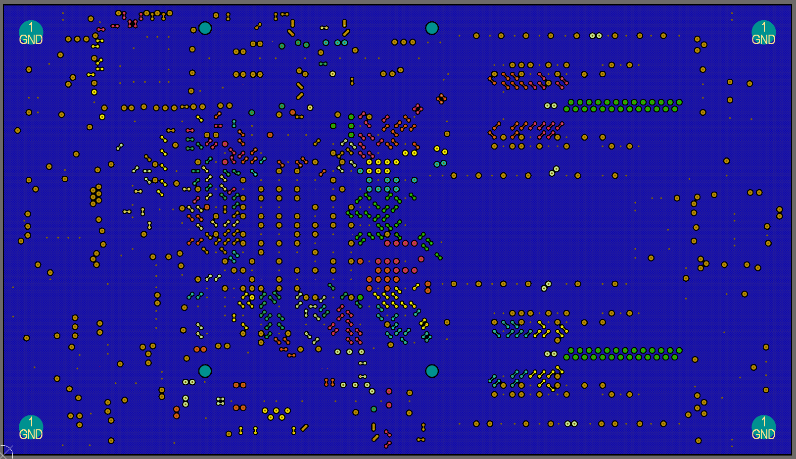 |
| L3 | 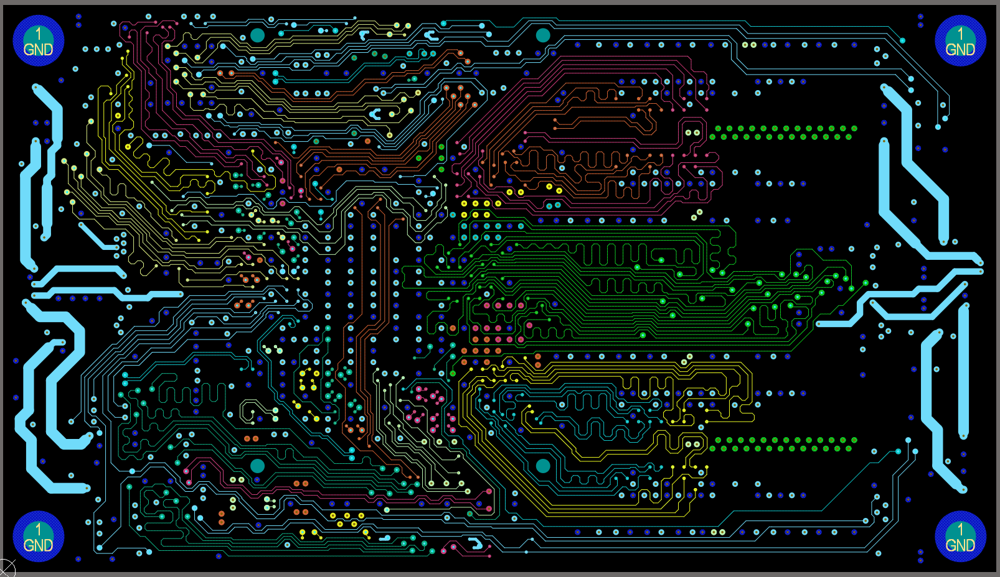 |
| L4 | 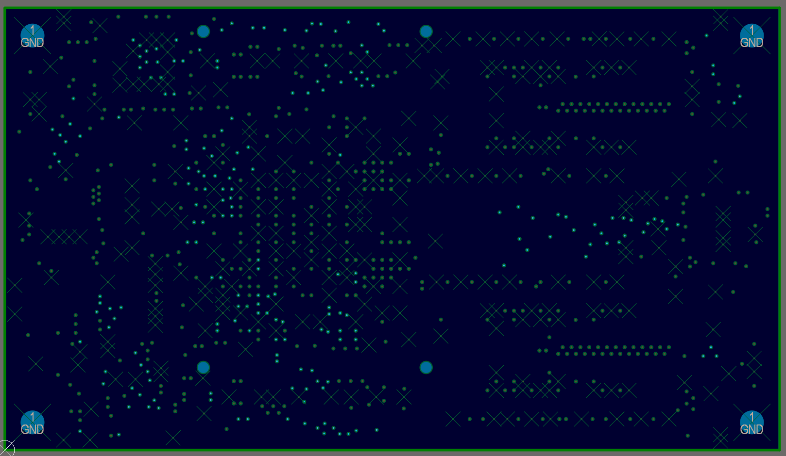 |
| L5 | 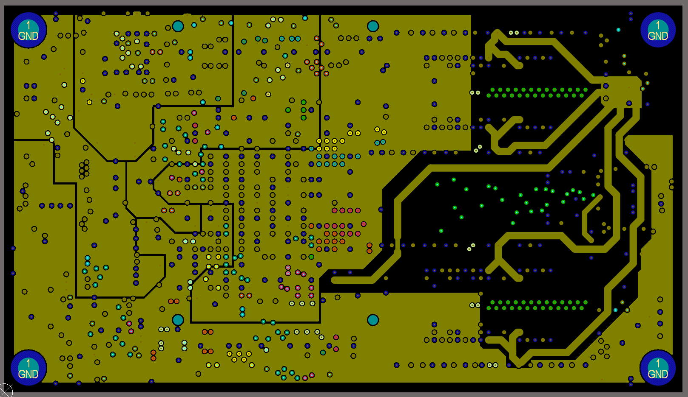 |
| L6 | 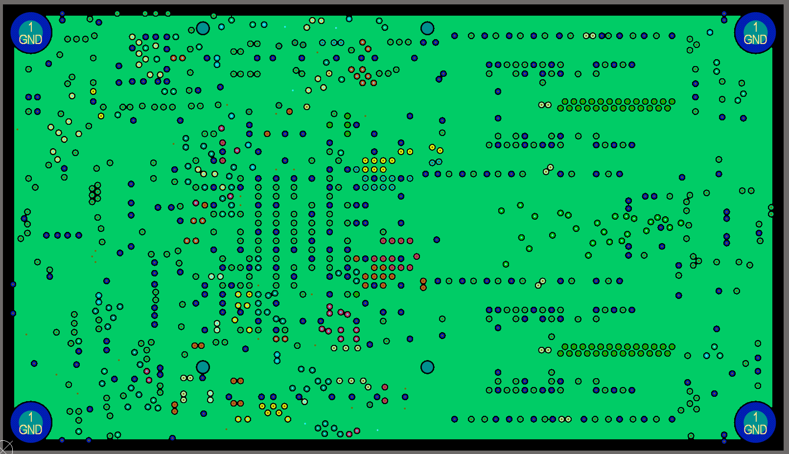 |
| L7 | 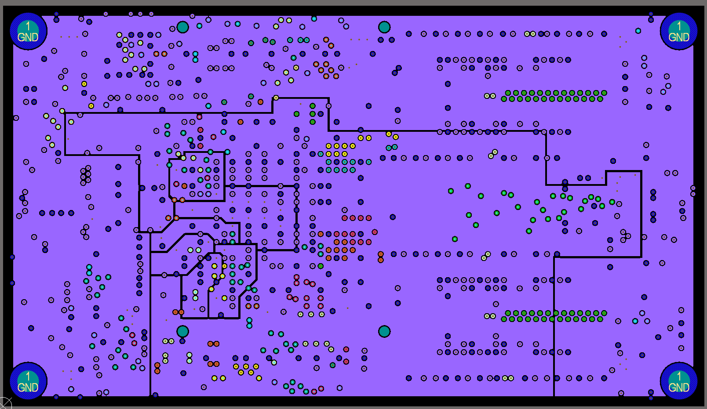 |
| L8 | 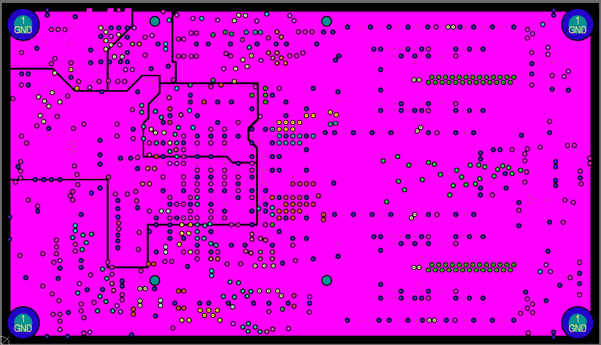 |
| L9 | 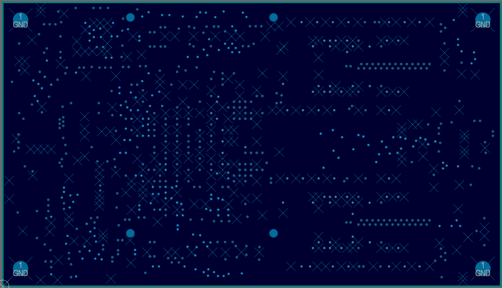 |
| L10 | 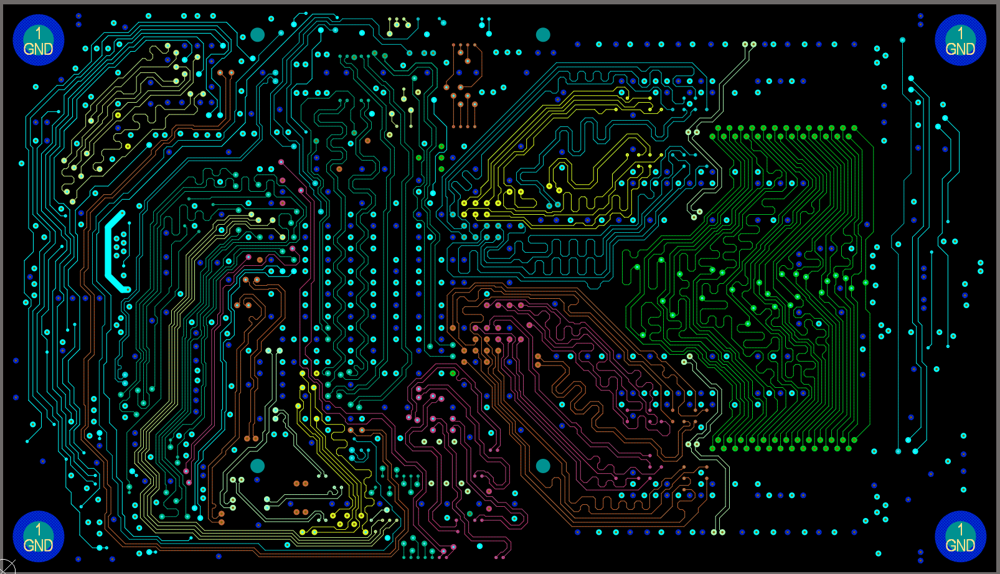 |
| L11 | 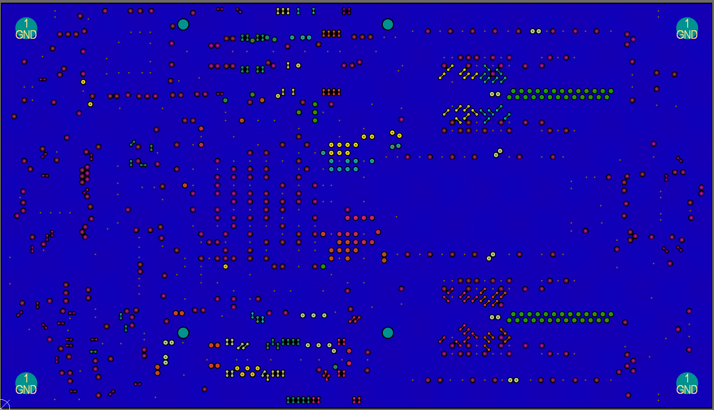 |
| L12 — Bottom Copper | 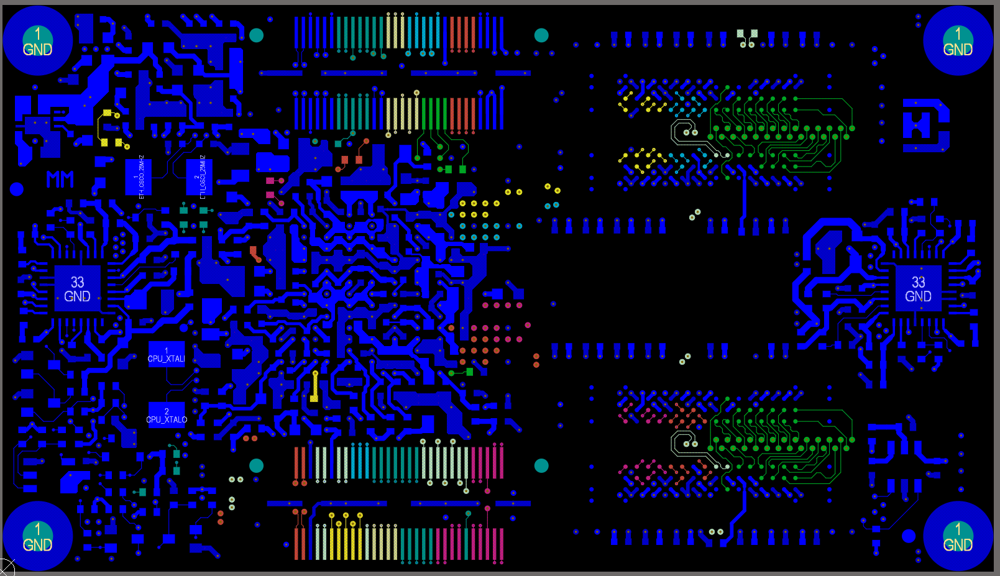 |

---

## 🧠 Processor & Key Components

| Component | Details |
|-----------|---------|
| **SoC** | NXP i.MX6 (Solo / Dual / Quad) |
| **RAM Interface** | DDR3 / DDR3L |
| **Form Factor** | SoM (System-on-Module) |
| **Connectors** | High-density board-to-board (J1, J2) |
| **Power** | Multi-rail PMIC with 1V375, 1V5, 2V5, 3V3 rails |
| **Crystal** | CPU XTALI / XTALO oscillator circuit |
| **Ethernet PHY** | On-board (ETH) |

---

## 📐 PCB Specifications

| Parameter | Value |
|-----------|-------|
| **Layers** | 12 |
| **Min Trace Width** | Controlled impedance differential pairs |
| **Mounting Holes** | 4× GND-connected mounting points |
| **Stackup** | Signal / GND / Signal / GND / Power / Power / Power / Power / GND / Signal / GND / Signal |

---

## 🔧 Layer Description

| Layer | Function |
|-------|----------|
| L1 | Signal — Top copper, component placement & fine routing |
| L2 | Ground plane |
| L3 | Signal — High-speed & DDR routing |
| L4 | Ground plane |
| L5 | Power plane |
| L6 | Power plane |
| L7 | Power plane |
| L8 | Power plane |
| L9 | Ground plane |
| L10 | Signal — DDR & high-speed routing |
| L11 | Ground plane |
| L12 | Signal — Bottom copper, passive components |

---

## 🛠️ Design Process

1. **Schematic** — Based on the open-source iMX6 Rex reference schematic (Wandboard project)
2. **Netlist Import** — Imported into EDA tool and components placed manually
3. **Component Placement** — SoC centered, DDR ICs flanking, power circuitry on periphery
4. **Layer Stackup Definition** — 12-layer impedance-controlled stackup defined
5. **Critical Routing** — DDR3 length-matched, differential pairs (USB, Ethernet, LVDS) impedance-controlled
6. **Power Planes** — Copper pours defined per rail with proper decoupling
7. **Via Strategy** — Blind/buried via patterns used around BGA to escape signals
8. **DRC & Review** — Design rule checks passed; stackup and impedance verified

---

## 📁 Repository Structure

```
iMX6-Rex-PCB/
├── README.md
├── iMX6_Rex_V1I1_PCB.png       # 3D render — front
├── iMX6_Rex_V1I1_PCB_B.png     # 3D render — back
├── L_1.png                      # Layer 1 (Top)
├── L_2.png                      # Layer 2
├── L_3.png                      # Layer 3
├── L_4.png                      # Layer 4
├── L_5.png                      # Layer 5
├── L_6.png                      # Layer 6
├── L_7.png                      # Layer 7
├── L_8.png                      # Layer 8
├── L_9.png                      # Layer 9
├── L_10.png                     # Layer 10
├── L_11.png                     # Layer 11
└── L_12.png                     # Layer 12 (Bottom)
```

---

## 📜 Credits & Open Source Acknowledgement

- **Reference Schematic:** [Wandboard iMX6 Rex](https://www.wandboard.org/) — open-source hardware project
- **PCB Layout:** Designed from scratch by **[Your Name]**
- The schematic was used as a reference only; all component placement, routing, layer stackup, and design decisions were made independently

---

## 📄 License

The original schematic is released under open-source hardware terms by the Wandboard project. The PCB layout files in this repository are the original work of the author.

---

